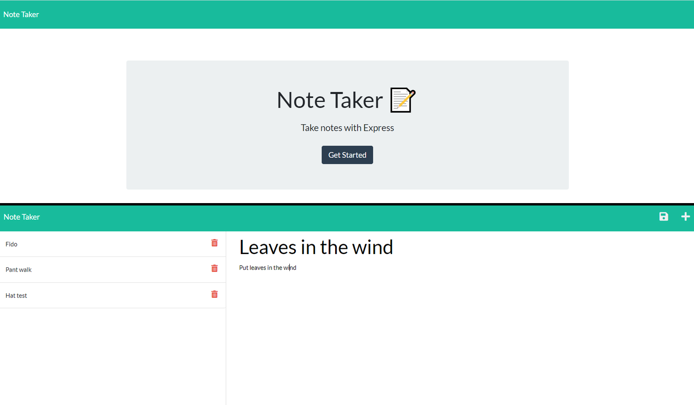

#  Module 11 : Note Taker with Express.js

## Overview

I have fixed the routes of an existing note taking application built using Express. These routes allow for the functonality needed for the app when deployed.

## Installation

N/A

## Usage

The app can be accessed using a browser through its Heroku deployment.
Notes can be added by clicking the save button after entering data, or deleted from the bar on the left using the trash can icon. Older notes can be viewed by clicking the task title on the left.

### Links

 [Github Repo](https://github.com/sashdc/The-note-book)
 
 [Heroku Deployment](https://the-note-yard.herokuapp.com/)

 ## Credits

Cherian, Saharsh

[Creator Github](https://github.com/sashdc)

## License

N/A